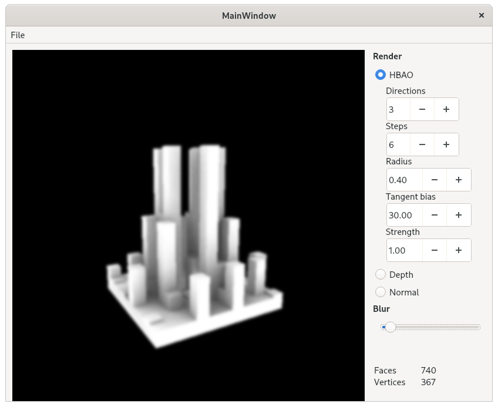
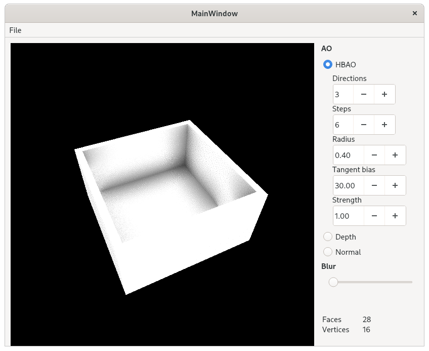
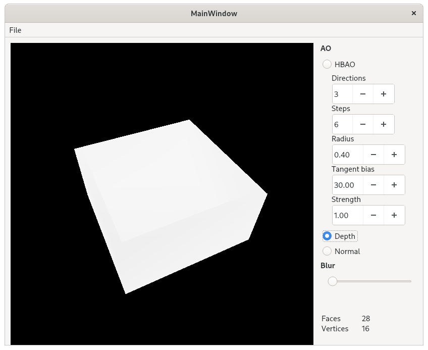
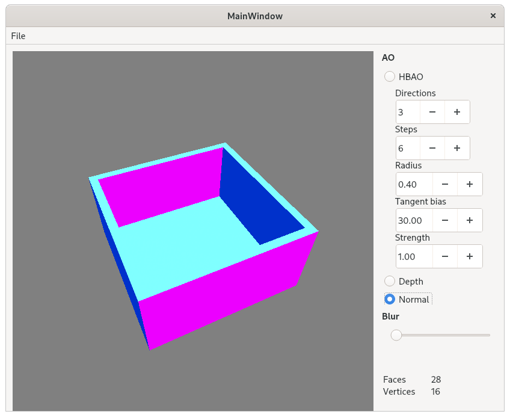

# HBAO
An Horizon Based Ambient Occlusion implementation. Qt 5 used as the base framework.

A more detailed documentation can be found [here](https://github.com/GerardMT/HBAO/tree/master/docs/report/report.pdf).

## Features
- Tweak the multiple HBAO parameters.
- Set a custom blur to smooth the HBAO.
- Visualize the G-buffer.
- Load any triangulated PLY moddel.

## Requirements
The software requires the following libraries to be installed:
- GLEW
- Eigen
- QT 5

## Build
Clone the repository:

	git clone https://github.com/GerardMT/HBAO
	cd HBAO

Compile the code:

    cd src
    qmake-qt5
    make

The builds can be found at `build/`.

## Run
Once build, run the project from the build directory:

	cd ../build/release/
	./hbao

## Screenshots
 
  